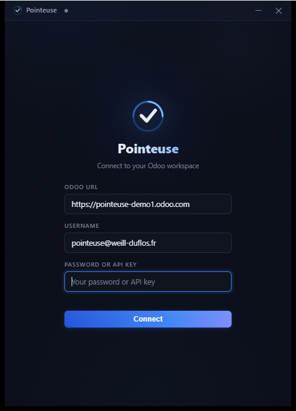
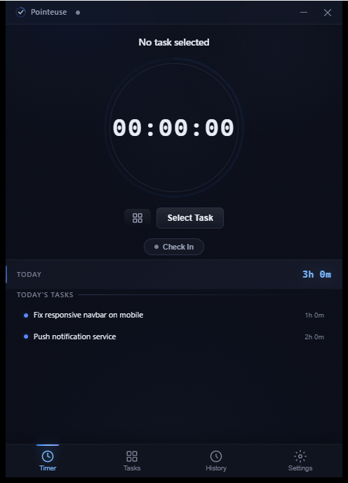
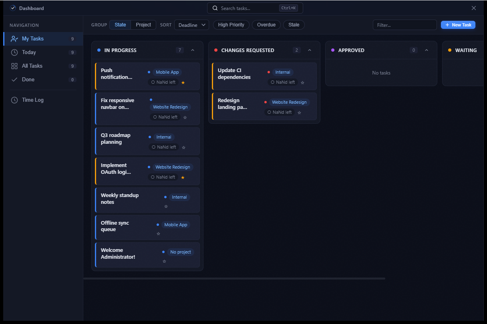
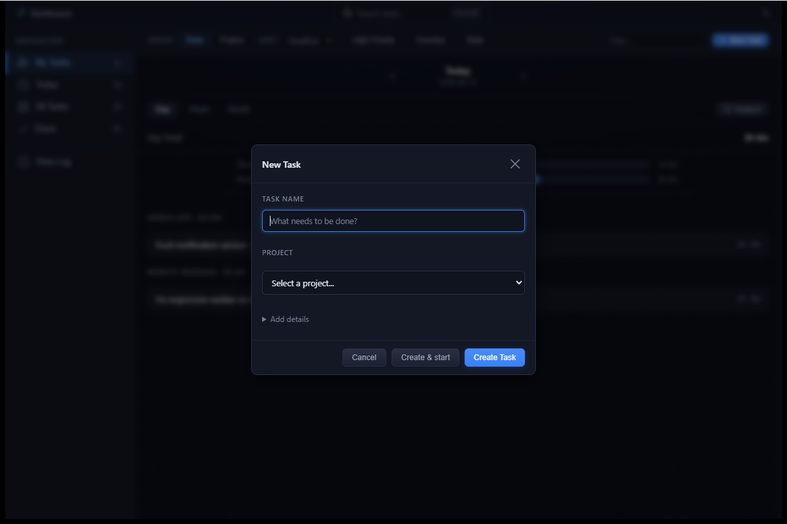

# Pointeuse

A fast, native time tracker for [Odoo](https://www.odoo.com/) — desktop (Windows / Linux / macOS) and Android. Built with Tauri 2, a Rust backend, and a zero-framework vanilla JS frontend.

*Pointeuse* is French for a punch clock.

## Screenshots

<p align="center">
  
  &nbsp;&nbsp;
  
</p>
<p align="center"><em>Connect to any Odoo instance &middot; track time against a task, with today's totals at a glance</em></p>

<p align="center">
  
</p>
<p align="center"><em>Task dashboard — kanban grouped by stage, with effort bars, deadlines, and one-click timer start</em></p>

<p align="center">
  
</p>
<p align="center"><em>Create a task — and optionally start tracking it — without leaving the app</em></p>

> Screens use a throwaway Odoo demo with sample projects/tasks.

## What it does

- **Track time against Odoo tasks** — start/stop a timer on any `project.task`, timesheets land in `account.analytic.line`
- **Attendance integration** — check in / check out (`hr.attendance`) from the app or the system tray; the timer auto-stops when you check out from anywhere else (Odoo web, mobile)
- **Idle reminders** — a configurable popup asks what you're working on, with quick-switch suggestions; on Android these are notifications with action buttons
- **Offline-first** — all Odoo data is cached in SQLite; timesheets queue locally when offline and sync when the connection returns
- **Synced across your devices** — start a timer on your phone and your desktop picks it up (and vice versa); stopping anywhere stops it everywhere. Runs over your Odoo server, so there is nothing extra to host, and the timer keeps working at full speed even when Odoo is slow or unreachable
- **Task dashboard** — kanban board grouped by stage/project, task detail panel, time log with day/week/month views
- **System tray** — timer status, attendance toggle, quick controls
- **Three themes** — dark, light, and a colorblind-friendly palette

## How it connects

Pointeuse talks to any Odoo 14+ instance over standard XML-RPC (`/xmlrpc/2/`) — no server-side module to install. You need:

- your Odoo server URL
- your database name
- your login + password — or an **API key** (required for Odoo Online / SaaS, where the account password is blocked for external XML-RPC); stored in the system keyring, never on disk

## Install

Grab the latest installer from [Releases](https://github.com/Leicas/pointeuse/releases):

- **Windows**: `Pointeuse_x.y.z_x64-setup.exe` (auto-updates)
- **Linux**: `.AppImage` or `.deb`
- **macOS**: `.dmg` (universal)
- **Android**: closed beta on Google Play — [how to join](https://leicas.github.io/pointeuse/#en-beta) — or sideload `pointeuse-vx.y.z-android-universal.apk`

## Development

```bash
npm install          # Tauri CLI + API
npm run dev          # desktop dev mode (hot-reload frontend, compiles Rust)
npm run build        # production build for the current platform
```

Android:

```bash
npm run android:init   # generate gen/android/ + apply the overlay patches
npm run android:dev    # run on a connected device/emulator
npm run android:build  # release APK/AAB (needs key.properties for signing)
```

Rust-only workflows from `src-tauri/`:

```bash
cargo check
cargo clippy --all-targets --all-features
```

See [ARCHITECTURE.md](ARCHITECTURE.md) for the full design (module map, Odoo protocol notes, caching strategy, background tasks).

## Releases

Commits to `main` follow [Conventional Commits](https://www.conventionalcommits.org/); semantic-release cuts versions, GitHub Actions builds all platforms, and the desktop apps self-update from GitHub Releases.

## License

[MIT](LICENSE)
